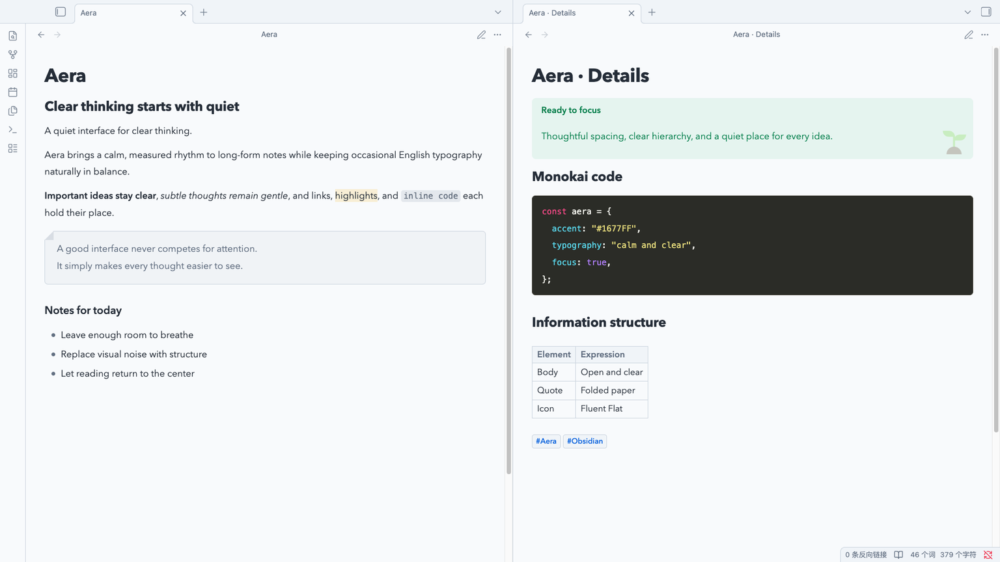

# Aera

> A quiet interface for clear thinking.

Aera is a Chinese-first Obsidian theme shaped around calm reading, clear
hierarchy, and restrained detail. It gives Chinese text a comfortable rhythm
while keeping occasional English typography, code, and interface elements in
balance.



## Design

Aera keeps Obsidian familiar. It respects the app's reading width and user font
size, then refines the surfaces around them with a quiet blue accent, generous
line height, and a neutral foundation that works in both light and dark mode.

The theme is designed to stay out of the way during long writing sessions while
still giving structured notes a distinct visual identity.

## Highlights

- Chinese-first typography with balanced English text
- Calm light and dark palettes built around `#1677FF`
- Borderless semantic callouts with Fluent Emoji Flat illustrations
- Paper-like blockquotes with a subtle folded corner
- Monokai fenced code blocks and understated inline code
- Refined headings, links, lists, tables, properties, tags, and embeds
- Desktop and mobile support without overriding user-controlled text sizing

## Installation

### Community themes

1. Open **Settings -> Appearance** in Obsidian.
2. Select **Manage** under Themes.
3. Search for **Aera**, then select **Install and use**.

### Manual installation

Download `manifest.json` and `theme.css` from the
[latest release](https://github.com/def-peter/obsidian-aera-theme/releases/latest),
place them in `<vault>/.obsidian/themes/Aera/`, and select Aera from Obsidian's
Appearance settings.

## Updating

Community theme updates appear in **Settings -> Appearance**. Use **Check for
updates** to install the latest published version. Manual installations can be
updated by replacing `manifest.json` and `theme.css` with the latest release
assets.

## Development

Install dependencies and compile the theme:

```bash
npm install
npm run build
```

Run the complete test, policy, and contrast suite before committing:

```bash
npm run check
```

### Live preview

For live preview, set `AERA_TEST_VAULT` to a dedicated test vault, then run
`npm run link:vault` and `npm run dev`. The linker refuses to replace unknown
notes named `Theme Playground.md` or `Embedded Note.md`. Changes to
`manifest.json` require an Obsidian restart, while
compiled CSS automatically reloads in the linked vault.

Fluent Emoji assets are pinned and embedded in the compiled stylesheet. Run
`npm run assets:sync` only when intentionally refreshing those source assets.

## Release assets

Every release contains the installable `manifest.json` and `theme.css` files.
Release tags must match the version recorded in the theme metadata.

## Credits and license

Aera is available under the [MIT](LICENSE) License. The embedded Fluent Emoji
Flat assets are provided by Microsoft under the MIT License; full attribution
is available in [THIRD_PARTY_NOTICES.md](THIRD_PARTY_NOTICES.md).
